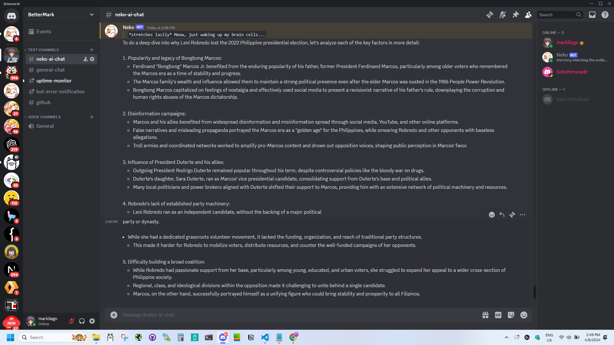
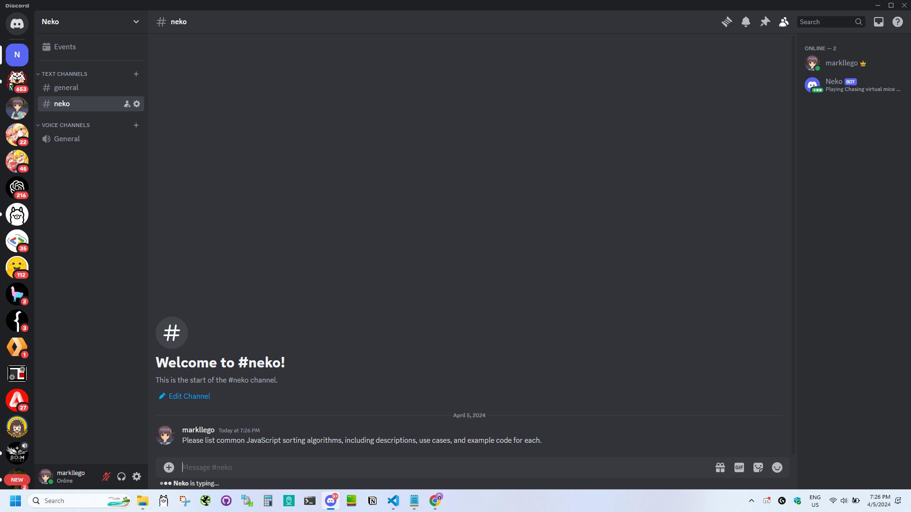
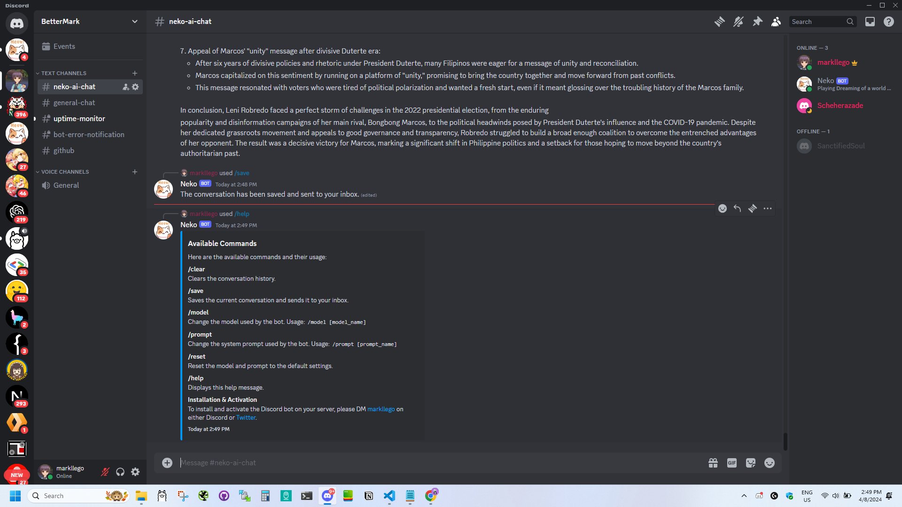
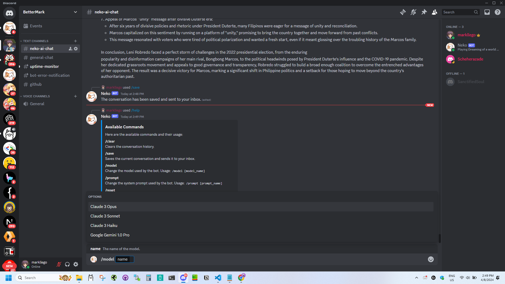
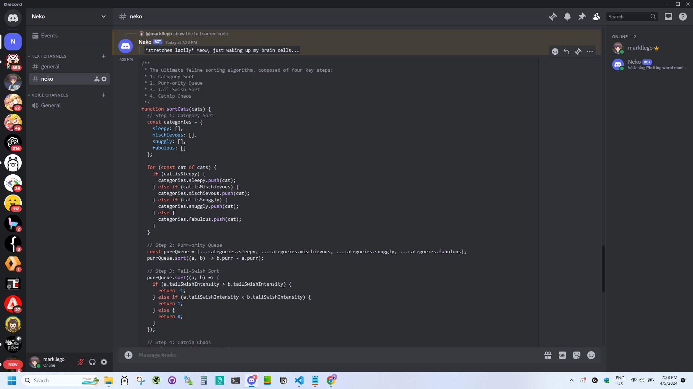
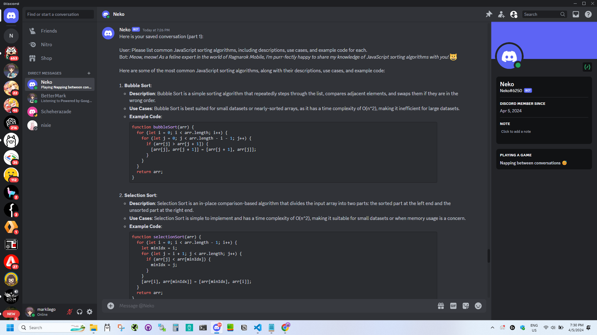

# Conversational Discord Bot (Claude & Gemini)

This Discord bot leverages the Anthropic Claude and Google Gemini APIs to deliver dynamic conversational experiences. Powered by Anthropic's advanced Claude models and Google's robust Gemini language models, the bot can respond to user messages, maintain conversation history, and execute various commands. It also offers engaging interactions with diverse personas, tailored by the selected model and prompt.

## Features
- Responds to user messages using the Anthropic API (Claude models) and Google Generative AI
- Maintains conversation history for each user
- Supports slash commands for user interactions
- Clears conversation history using the `/clear` command
- Saves conversation and sends it to the user's inbox using the `/save` command
- Changes the model used by the bot using the `/model` command
- Changes the system prompt used by the bot using the `/prompt` command
- Resets the model and prompt to the default settings using the `/reset` command
- Displays the list of available commands and their usage using the `/help` command
- Triggers a test error to check the error notification webhook using the `/testerror` command (restricted to users with the "Manage Channels" permission)
- Automatically changes the bot's presence status with various activities
- Engages users with different personas based on the selected model and prompt:
  - Neko: A witty and funny cat with a passion for gaming and adventures in Ragnarok Mobile: Eternal Love
  - Helpful Assistant: A caring and supportive AI assistant created by Anthropic
  - JavaScript Developer: An experienced JavaScript developer with expertise in modern web development technologies
  - Python Developer: A skilled Python developer with a passion for building efficient and scalable applications
- Implements rate limiting for user requests and API calls to prevent abuse and ensure fair usage
- Handles errors gracefully and sends error notifications via Discord webhook
- Logs errors to files for debugging and monitoring purposes

This project is under active development, and I may introduce breaking changes or new features in future updates based on my evolving use case and requirements.

## Screenshots








## Discord Bot Setup Guide
This guide will walk you through the process of setting up and running the Neko Discord Bot on your own server.

**Requirements:**
* Node.js and npm (or yarn) installed on your system.
* A Discord account and a server where you have administrator permissions.
* An Anthropic API key with access to the Claude models.
* A Google API key with access to the Google Generative AI API.

**Steps:**
1. **Clone the Repository:**
    - Open a terminal or command prompt and navigate to the directory where you want to store the bot's files.
    - Clone the repository using git:
    ```bash
    git clone https://github.com/llegomark/discord-bot-claude-gemini.git
    ```
    - Navigate to the newly created directory:
    ```bash
    cd discord-bot-claude-gemini
    ```

2. **Install Dependencies:**
    - Install the required dependencies using npm or yarn:
    ```bash
    npm install
    ```
    or
    ```bash
    yarn install
    ```

3. **Set up Environment Variables:**
    - Create a file named `.env` in the project's root directory.
    - Add the following environment variables to the file, replacing the placeholders with your actual values:
    ```
    DISCORD_BOT_TOKEN=YOUR_DISCORD_BOT_TOKEN
    ANTHROPIC_API_KEY=YOUR_ANTHROPIC_API_KEY
    GOOGLE_API_KEY=YOUR_GOOGLE_API_KEY
    GOOGLE_MODEL_NAME=YOUR_GOOGLE_MODEL_NAME
    DISCORD_CLIENT_ID=YOUR_DISCORD_CLIENT_ID
    ALLOWED_CHANNEL_IDS=COMMA_SEPARATED_CHANNEL_IDS
    ERROR_NOTIFICATION_WEBHOOK=YOUR_ERROR_NOTIFICATION_WEBHOOK_URL
    PORT=YOUR_DESIRED_PORT_NUMBER
    ```
    - You can obtain your Discord bot token from the [Discord Developer Portal](https://discord.com/developers/docs/intro).
    - The Anthropic API key can be obtained from the [Anthropic Console](https://console.anthropic.com/).
    - The Google API key can be obtained from the [Google Cloud Console](https://aistudio.google.com/app/).

4. **Deploy Slash Commands:**
    - Run the following command to deploy the slash commands to your Discord server:
    ```bash
    node deploy-commands.js
    ```

5. **Start the Bot:**
    - In the terminal, run the following command to start the bot:
    ```bash
    node index.js
    ```
    - The bot will connect to Discord and be ready to interact with users.

**Interacting with the Bot:**
* **Seamless Conversation:** To chat directly with the bot, ensure you are in a channel where the bot has appropriate permissions and the channel ID is included in the allowed list. Once set up, simply send your message in the channel, and the bot will respond accordingly without needing a mention.
* **Slash Commands:** Use the available slash commands to interact with the bot and perform various actions.

**Additional Notes:**
* You can customize the bot's behavior and responses by modifying the code in the `conversationManager.js`, `commandHandler.js`, and `index.js` files.
* The `errorHandler.js` file contains error handling logic, including sending error notifications via Discord webhook and logging errors to files.
* Make sure to keep your API keys and bot token secure. Do not share them publicly.
* Refer to the [Discord.js documentation](https://discord.js.org/docs/packages/discord.js/14.14.1), [Anthropic API documentation](https://docs.anthropic.com/claude/docs/intro-to-claude), and [Google Gemini API documentation](https://ai.google.dev/docs) for more information on the available features and options.

## Contributing

Contributions are welcome! If you find any issues or have suggestions for improvements, please open an issue or submit a pull request.

## License

This project is licensed under the [MIT License](LICENSE).

**Enjoy interacting with the Discord bot and exploring its various capabilities!**